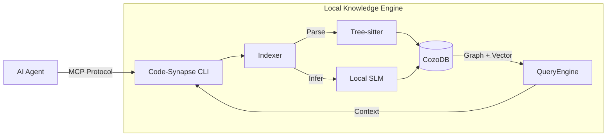

# 🧠 Code-Synapse

**An agent-first knowledge engine that bridges the gap between blind syntax generation and deep, intent-aware engineering.**

---

## 🚨 The Problem: "Vibe Coding" Has a Blind Spot

AI coding tools (Cursor, Windsurf, Claude Code) are incredible at generating syntax, but they often fail at **engineering**. Why?

Because they treat your codebase as a bag of text files. They don't understand:

* **Why** a specific function exists (Business Intent).
* **How** data flows across service boundaries (Architecture).
* **What** features will break if this line changes (Dependency Impact).

They "vibe" their way to a solution, often guessing at implementation details. This leads to code that looks correct but breaks business logic, introduces regression bugs, or reinvents the wheel because the agent didn't know a utility function already existed.

## 💡 The Solution: A Living Knowledge Graph

**Code-Synapse** is a local "sidecar" engine that runs alongside your AI agent. It transforms your raw code into a structured **Knowledge Graph** optimized for machine reasoning, not just human search.

It doesn't just index *what* your code is; it indexes **why it is there**.

### The 4-Layer "Brain"

Unlike standard tools (LSP, grep) that only see syntax, Code-Synapse builds a multi-layered index :

1. **Syntax Layer (AST):** Precise definitions of functions, classes, and variables.
2. **Semantic Layer (Data Flow):** How symbols relate, imports/exports, and type hierarchies.
3. **Architectural Layer (Structure):** Service boundaries, API contracts, and design patterns.
4. **Business Logic Layer (Intent):** The "Why." We use a local Small Language Model (SLM) to infer the business purpose of code blocks (e.g., *"This function validates Stripe tokens for the checkout flow"*).

---

## ✨ Key Features

* **⚡ Zero-Config "Sidecar":** Runs locally on your machine. No Docker required. Just `npx code-synapse start`.
* **🔌 Agent-First Design:** Built natively on the **Model Context Protocol (MCP)**. Works out-of-the-box with Claude Desktop, Cursor, and any MCP-compliant tool.
* **🧠 Hybrid Intelligence:** Combines deterministic Static Analysis (Tree-sitter) for 100% accuracy with probabilistic AI Inference (Local LLM) for deep context.
* **🔒 Privacy-First:** Your code never leaves your machine. We use an embedded database (**CozoDB** with RocksDB backend) and local models (**Qwen 2.5 Coder**) to keep everything offline.
* **🔄 Incremental Indexing:** Smart file-watching ensures the graph is updated in milliseconds when you save a file.

---

## 🚀 Quick Start

### 1. Installation

Install the CLI globally via npm:

```bash
npm install -g code-synapse

```

### 2. Initialization

Navigate to your project root and initialize the graph:

```bash
cd my-project
code-synapse init

```

*This will download the necessary parsers and the local embedding model (approx. 100MB).*

### 3. Connect Your Agent (e.g., Claude Desktop)

Add Code-Synapse to your MCP configuration file:

**File:** `~/Library/Application Support/Claude/claude_desktop_config.json` (macOS)

```json
{
  "mcpServers": {
    "code-synapse": {
      "command": "code-synapse",
      "args": ["start"],
      "env": {
        "PROJECT_ROOT": "/absolute/path/to/your/project"
      }
    }
  }
}

```

### 4. Usage

Restart your AI Agent. You can now ask complex, context-aware questions:

> *"How does the checkout process handle failed payments? Explain the business logic."*
> *"Refactor the `UserAuth` class. First, check who calls it and what business features depend on it to ensure no regressions."*

---

## 🏗️ Architecture

Code-Synapse is designed as a modular TypeScript application using the following stack:

| Layer | Technology | Purpose |
|-------|------------|---------|
| **Runtime** | TypeScript (Node.js) | Main orchestrator |
| **Parsing** | `web-tree-sitter` (WASM) | Universal language AST parsing |
| **Database** | **CozoDB** (RocksDB backend) | Unified graph + vector storage |
| **Embeddings** | `@huggingface/transformers` (ONNX) | Local embedding generation |
| **LLM** | `node-llama-cpp` | Local business logic inference |
| **Protocol** | MCP SDK | AI agent communication |

### LLM Model Selection

Code-Synapse supports multiple local LLM models for business logic inference. Choose based on your hardware:

| Preset | Model | RAM | Best For |
|--------|-------|-----|----------|
| **fastest** | Qwen 2.5 Coder 0.5B | 1GB | Resource-constrained systems |
| **minimal** | Qwen 2.5 Coder 1.5B | 2GB | Laptops with limited RAM |
| **balanced** | Qwen 2.5 Coder 3B | 4GB | **Recommended default** |
| **quality** | Qwen 2.5 Coder 7B | 8GB | Production-quality analysis |
| **maximum** | Qwen 2.5 Coder 14B | 16GB | Maximum quality |

**Supported model families:**
- **Qwen 2.5 Coder** (Recommended) - Best-in-class for code tasks
- **Llama 3.x** - General-purpose from Meta
- **CodeLlama** - Code-specialized Llama variant
- **DeepSeek Coder** - Strong alternative to Qwen

### Why CozoDB?

We use **CozoDB** as a unified database for both graph relationships AND vector embeddings:

* **Graph Storage**: Stores structural relationships (CALLS, IMPORTS, EXTENDS, IMPLEMENTS)
* **Vector Search**: HNSW indices for semantic similarity search
* **Single Database**: No synchronization between separate graph/vector DBs
* **Datalog Queries**: Powerful recursive queries via CozoScript



### Data Pipeline

```
File System → Scanner → Parser (Tree-sitter) → Semantic Analyzer (TS Compiler)
     ↓
Entity Extraction → Graph Writer → CozoDB (RocksDB)
     ↓
Embeddings (ONNX) → Vector Index (HNSW)
```

---

## 🗺️ Roadmap

### Completed

- [x] **Foundation**: Project scaffolding, CLI framework, utilities
- [x] **Graph Database**: CozoDB integration with schema migrations
- [x] **File Scanner**: Project detection, file discovery, change detection
- [x] **Code Parser**: Tree-sitter WASM parsing for TS/JS
- [x] **Semantic Analysis**: TypeScript Compiler API for type resolution
- [x] **Entity Extraction**: Functions, classes, interfaces, relationships
- [x] **Graph Builder**: Atomic writes, incremental updates
- [x] **Indexer & Watcher**: Pipeline orchestration, file watching

### In Progress

- [x] **MCP Server**: AI agent communication interface
- [x] **LLM Integration**: Business logic inference with local models (12 models supported)
- [ ] **CLI Polish**: Full command implementations

### Future

- [ ] Python language support
- [ ] Cross-repository dependency mapping
- [ ] GraphRAG hierarchical summarization
- [ ] IDE Extensions (VS Code sidebar)

## 🤝 Contributing

We are building the standard for how AI Agents understand code. Contributions are welcome!

1. Fork the repository.
2. Install dependencies: `pnpm install`
3. Run the dev server: `pnpm dev`
4. Submit a Pull Request.

## 📄 License

Apache 2.0 - Open and free for everyone.
