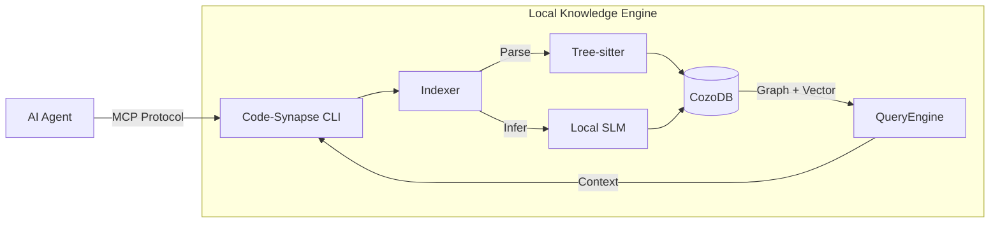

# 🧠 Code-Synapse

[](LICENSE)
[](https://nodejs.org/)
[](https://www.typescriptlang.org/)
[](https://pnpm.io/)

**An agent-first knowledge engine that bridges the gap between blind syntax generation and deep, intent-aware engineering.**

Code-Synapse transforms your codebase into a structured Knowledge Graph optimized for AI reasoning. It runs locally as a sidecar alongside AI coding assistants (Claude Code, Cursor) via the Model Context Protocol (MCP), providing deep code understanding without sending your code to external services.

---

## Table of Contents

- [The Problem](#-the-problem-vibe-coding-has-a-blind-spot)
- [The Solution](#-the-solution-a-living-knowledge-graph)
- [Key Features](#-key-features)
- [Quick Start](#-quick-start)
- [Documentation](#-documentation)
- [CLI Commands](#-cli-commands)
- [MCP Tools](#-mcp-tools-available)
- [Architecture](#-architecture)
- [Roadmap](#-roadmap)
- [Contributing](#-contributing)
- [Support](#-support)
- [License](#-license)

---

## 🚨 The Problem: "Vibe Coding" Has a Blind Spot

AI coding tools (Cursor, Windsurf, Claude Code) are incredible at generating syntax, but they often fail at **engineering**. Why?

Because they treat your codebase as a bag of text files. They don't understand:

* **Why** a specific function exists (Business Intent).
* **How** data flows across service boundaries (Architecture).
* **What** features will break if this line changes (Dependency Impact).

They "vibe" their way to a solution, often guessing at implementation details. This leads to code that looks correct but breaks business logic, introduces regression bugs, or reinvents the wheel because the agent didn't know a utility function already existed.

## 💡 The Solution: A Living Knowledge Graph

**Code-Synapse** is a local "sidecar" engine that runs alongside your AI agent. It transforms your raw code into a structured **Knowledge Graph** optimized for machine reasoning, not just human search.

It doesn't just index *what* your code is; it indexes **why it is there**.

### The 4-Layer "Brain"

Unlike standard tools (LSP, grep) that only see syntax, Code-Synapse builds a multi-layered index :

1. **Syntax Layer (AST):** Precise definitions of functions, classes, and variables.
2. **Semantic Layer (Data Flow):** How symbols relate, imports/exports, and type hierarchies.
3. **Architectural Layer (Structure):** Service boundaries, API contracts, and design patterns.
4. **Business Logic Layer (Intent):** The "Why." We use a local Small Language Model (SLM) to infer the business purpose of code blocks (e.g., *"This function validates Stripe tokens for the checkout flow"*).

---

## ✨ Key Features

* **⚡ Zero-Config "Sidecar":** Runs locally on your machine. No Docker required. Just `code-synapse` to get started.
* **🔌 Agent-First Design:** Built natively on the **Model Context Protocol (MCP)**. Works out-of-the-box with Claude Desktop, Cursor, and any MCP-compliant tool.
* **🧠 Hybrid Intelligence:** Combines deterministic Static Analysis (Tree-sitter) for 100% accuracy with probabilistic AI Inference (Local LLM) for deep context.
* **🎯 Business Justification:** Local LLM infers *why* code exists - its purpose, business value, and feature context.
* **🏷️ Business Layer Classification:** Automatically categorizes code as **Domain** (business logic, user-facing) or **Infrastructure** (platform, cross-cutting).
* **📜 Change Ledger:** Append-only event log tracks all system changes for time-travel debugging and observability.
* **🔄 Adaptive Indexing:** Observes MCP queries and code changes, correlates them semantically, and triggers intelligent re-indexing.
* **🔒 Privacy-First:** Your code never leaves your machine. We use an embedded database (**CozoDB** with RocksDB backend) and local models (**Qwen 2.5 Coder**) to keep everything offline.
* **🔄 Incremental Indexing:** Smart file-watching ensures the graph is updated in milliseconds when you save a file.
* **🔍 Natural Language Search:** Query your codebase in plain English - "most complex functions", "where is createParser", "what calls main".
* **📊 Web Viewer:** Visual dashboard with REST API for exploring indexed code, statistics, and call graphs.

### 🎯 How Business Justification Works

Code-Synapse doesn't just index *what* your code does - it understands *why* it exists:

```
Your Code                          What Code-Synapse Understands
─────────────────────────────────────────────────────────────────────
function validateCreditCard()  →   Purpose: "Validates credit card numbers"
  in src/payments/processor.ts     Business Value: "Ensures PCI compliance"
                                   Feature: "Payment Processing"
                                   Confidence: 85%
```

**The process:**
1. **Analyze** - Examines code structure, naming patterns, file paths, and doc comments
2. **Infer** - Local LLM determines purpose, business value, and feature area
3. **Propagate** - Context flows up/down the hierarchy (file → class → method)
4. **Clarify** - Generates questions for low-confidence entities (interactive mode)

### 🌐 Supported Languages (24 total)

| Language | Extensions | Extracted Entities |
|----------|------------|-------------------|
| **TypeScript** | `.ts`, `.tsx` | Functions, classes, interfaces, types, imports/exports |
| **JavaScript** | `.js`, `.jsx`, `.mjs`, `.cjs` | Functions, classes, imports/exports |
| **Go** | `.go` | Functions, methods, structs, interfaces, imports |
| **Rust** | `.rs` | Functions, structs, traits, impl blocks, use declarations |
| **Python** | `.py`, `.pyi`, `.pyw` | Functions, classes, methods, imports, decorators |
| **Java** | `.java` | Classes, interfaces, methods, fields, imports |
| **C** | `.c`, `.h` | Functions, structs, static functions, parameters |
| **C++** | `.cpp`, `.cc`, `.cxx`, `.hpp`, `.hh`, `.hxx`, `.h++`, `.ipp` | Classes, structs, templates, inheritance, methods |
| **C#** | `.cs` | Classes, structs, interfaces, methods, properties, async |
| **Kotlin** | `.kt`, `.kts` | Classes, interfaces, objects, data classes, suspend functions |
| **Swift** | `.swift` | Classes, structs, protocols, functions *(WASM pending)* |
| **Dart** | `.dart` | Classes, mixins, functions, async *(WASM pending)* |
| **Ruby** | `.rb`, `.rake`, `.gemspec` | Classes, modules, methods, attr_accessor |
| **PHP** | `.php`, `.phtml`, `.php3`, `.php4`, `.php5`, `.phps` | Classes, interfaces, methods, traits, visibility |
| **Bash** | `.sh`, `.bash`, `.zsh` | Functions, shell scripts |
| **Scala** | `.scala`, `.sc`, `.sbt` | Classes, case classes, traits, objects, methods |
| **Haskell** | `.hs`, `.lhs` | Data types, type classes, functions, newtypes |
| **Elixir** | `.ex`, `.exs` | Modules, functions, behaviours *(WASM pending)* |
| **Lua** | `.lua` | Functions (prototype-based) *(WASM pending)* |
| **JSON** | `.json`, `.jsonc`, `.json5` | Data format (syntax validation only) |
| **YAML** | `.yaml`, `.yml` | Data format (syntax validation only) |
| **TOML** | `.toml` | Data format (syntax validation only) |

---

## 📋 Requirements

- **Node.js**: v20.0.0 or higher (v25 recommended for development)
- **Package Manager**: pnpm v9.0.0+ (recommended), npm, or yarn
- **AI Agent**: Claude Code, Cursor, or any MCP-compliant tool
- **RAM**: 2GB minimum (4GB+ recommended for LLM inference)
- **Disk Space**: ~500MB for dependencies + model storage (varies by LLM model)

## 🚀 Quick Start

### 1. Installation

**Option A: Install from npm (Recommended)**

```bash
npm install -g code-synapse
```

**Option B: Install from source**

```bash
git clone https://github.com/code-synapse/code-synapse.git
cd code-synapse
pnpm install && pnpm build
pnpm link --global
```

**Verify installation:**

```bash
code-synapse --version
```

### 2. Run Code-Synapse

Navigate to your project and run Code-Synapse. It will automatically:
- Initialize if not already set up
- Index your codebase
- Start the Web Viewer with REST API and NL Search
- Start the MCP server for AI agent communication

```bash
cd my-project
code-synapse                   # One command does it all!
```

**Output:**
```
✔ Project initialized
✔ Project indexed
✔ Web Viewer started on port 3101
  → Dashboard: http://127.0.0.1:3101
  → NL Search: http://127.0.0.1:3101/api/nl-search?q=your+query
✔ MCP server started on port 3100
```

**Options:**
```bash
code-synapse --port 3200          # Use specific MCP port
code-synapse --viewer-port 3201   # Use specific viewer port
code-synapse --debug              # Enable debug logging
code-synapse --skip-index         # Skip indexing (if already indexed)
code-synapse --skip-viewer        # Skip web viewer (MCP server only)
```

**Or use individual commands:**
```bash
code-synapse init              # Initialize configuration only
code-synapse index             # Build the knowledge graph only
code-synapse viewer            # Start web viewer only
code-synapse start             # Start MCP server only
code-synapse status            # Check status
```

### 3. Connect Your AI Agent

Code-Synapse uses **stdio transport** (command execution) as the primary method. The AI agent will automatically start and manage the Code-Synapse server.

#### Claude Code

Add to `~/.claude.json` (user scope) or project-level `.mcp.json` (project scope):

```json
{
  "mcpServers": {
    "code-synapse": {
      "command": "code-synapse",
      "args": ["start"],
      "cwd": "${workspaceFolder}"
    }
  }
}
```

**Configuration Locations:**

| Location | Scope | Use Case |
|----------|-------|----------|
| `~/.claude.json` | User | Available across all projects |
| `.mcp.json` | Project | Project-specific, shared via source control |

**Verify connection** (within Claude Code):
```
/mcp
```

**Alternative: HTTP Transport**

If you prefer HTTP transport, start the server manually:
```bash
code-synapse start --port 3100
```

Then configure:
```json
{
  "mcpServers": {
    "code-synapse": {
      "type": "http",
      "url": "http://localhost:3100/mcp"
    }
  }
}
```

#### Cursor

Add to `.cursor/mcp.json` (project-specific) or `~/.cursor/mcp.json` (global):

```json
{
  "mcpServers": {
    "code-synapse": {
      "command": "code-synapse",
      "args": ["start"],
      "cwd": "${workspaceFolder}"
    }
  }
}
```

**Configuration Locations:**

| Location | Scope | Use Case |
|----------|-------|----------|
| `.cursor/mcp.json` | Project | Project-specific, shared via source control |
| `~/.cursor/mcp.json` | Global | Available across all projects |

**Using Code-Synapse:**

1. **Agent Mode**: The AI agent automatically uses MCP tools when relevant
2. **Toggle Tools**: Enable/disable specific tools in agent settings
3. **Tool Approval**: Agent asks for approval before using tools (can enable auto-run)
4. **View Responses**: Expandable views show tool arguments and responses

**Available Tools:**
- `search_code` - Search for code entities
- `get_function` - Get function details with call graph
- `get_class` - Get class with inheritance hierarchy
- `get_file` - Get file contents and symbols
- `get_callers` / `get_callees` - Function dependency analysis
- `get_imports` - Module dependency chain
- `get_project_stats` - Project statistics

**Alternative: HTTP Transport**

If you prefer HTTP transport, start the server manually:
```bash
code-synapse start --port 3100
```

Then configure:
```json
{
  "mcpServers": {
    "code-synapse": {
      "url": "http://localhost:3100/mcp"
    }
  }
}
```

**Troubleshooting:**

- **Tools not appearing**: Restart the AI agent after adding/updating MCP configuration
- **Command not found**: Ensure Code-Synapse is in your PATH or use absolute path in `command`
- **Permission errors**: Check file permissions on Code-Synapse binary
- **Server not starting**: Verify project is initialized (`code-synapse status`)

### 5. Query Your Codebase

Now ask complex, context-aware questions in your AI agent:

**In Claude Code:**
> *"How does the checkout process handle failed payments? Explain the business logic."*
> *"Refactor the `UserAuth` class. First, check who calls it and what business features depend on it to ensure no regressions."*

**In Cursor:**
> *"Search for authentication functions"*
> *"Find all functions that call the payment API and show their error handling."*
> *"What classes extend BaseService and what methods do they implement?"*

**Quick Setup:**
1. Add to `.cursor/mcp.json` or `~/.claude.json`:
   ```json
   {
     "mcpServers": {
       "code-synapse": {
         "command": "code-synapse",
         "args": ["start"],
         "cwd": "${workspaceFolder}"
       }
     }
   }
   ```
2. Restart your AI agent (Cursor/Claude Code)
3. Start asking questions!

---

## 📖 Documentation

- **[How It Works](./docs/HOW-IT-WORKS.md)** - Deep dive into architecture, data flow, MCP integration, and running from source
- **[Architecture](./docs/ARCHITECTURE.md)** - Technical design decisions, implementation status, and technology references
- **[Contributing](./CONTRIBUTING.md)** - Guidelines for contributing to Code-Synapse

### Documentation Structure

| Document | Audience | Purpose |
|----------|----------|---------|
| **README.md** | All users | Quick start, overview, installation |
| **HOW-IT-WORKS.md** | Users & Developers | Operational details, workflows, examples |
| **ARCHITECTURE.md** | Developers | Technical design, extension points, API reference |
| **CONTRIBUTING.md** | Contributors | Contribution guidelines, development setup |

---

## 🔧 CLI Commands

### Default Command

Running `code-synapse` without any subcommand automatically:
1. **Initializes** the project (if not already initialized)
2. **Indexes** the codebase (SCAN → PARSE → EXTRACT → WRITE)
3. **Justifies** code entities using local LLM (infers business purpose)
4. **Starts Web Viewer** with REST API and NL Search
5. **Starts MCP server** for AI agent communication

```bash
code-synapse                      # All-in-one command
code-synapse --port 3200          # Use specific MCP port
code-synapse --viewer-port 3201   # Use specific viewer port
code-synapse --debug              # Enable debug logging
code-synapse --skip-index         # Skip indexing step
code-synapse --skip-justify       # Skip business justification
code-synapse --justify-only       # Run only justification (skip indexing)
code-synapse --skip-viewer        # Skip web viewer
code-synapse -m balanced          # Set LLM model preset
```

**Options:**

| Option | Description |
|--------|-------------|
| `-p, --port <port>` | Port for MCP server (default: auto-detect 3100-3200) |
| `--viewer-port <port>` | Port for Web Viewer (default: auto-detect) |
| `-d, --debug` | Enable debug logging |
| `--skip-index` | Skip the indexing step |
| `--skip-justify` | Skip business justification (LLM inference) |
| `--justify-only` | Run only justification (assumes already indexed) |
| `-m, --model <preset>` | LLM model preset: `fastest`, `minimal`, `balanced`, `quality`, `maximum` |
| `--skip-viewer` | Skip starting the Web Viewer |

**Port Selection:**
- MCP server: Finds available port in range 3100-3200
- Web Viewer: Uses next available port after MCP
- If no port available in range, prompts you to enter a port
- Use `--port` and `--viewer-port` to specify ports directly

### Subcommands

| Command | Description |
|---------|-------------|
| `code-synapse init` | Initialize project configuration only |
| `code-synapse index` | Build/rebuild the knowledge graph only |
| `code-synapse justify` | Generate business justifications for code entities |
| `code-synapse justify --interactive` | Interactive clarification mode |
| `code-synapse justify --stats` | Show justification statistics |
| `code-synapse status` | Show project and index statistics |
| `code-synapse viewer` | Start the Web Viewer only |
| `code-synapse config --list-models` | List available LLM models |
| `code-synapse config --model <preset>` | Set LLM model (fastest/balanced/quality/maximum) |
| `code-synapse start` | Start the MCP server only |

### Justify Command Options

The `justify` command analyzes code and infers business purpose using a local LLM:

```bash
code-synapse justify                  # Justify all code entities
code-synapse justify --interactive    # Answer clarification questions
code-synapse justify --stats          # View justification statistics
code-synapse justify --file src/api.ts # Justify a specific file
code-synapse justify --skip-llm       # Use code analysis only (no LLM)
code-synapse justify -m quality       # Use higher quality model
code-synapse justify --force          # Re-justify all entities
```

**What it does:**
- Analyzes code structure (names, paths, doc comments)
- Uses local LLM to infer: purpose, business value, feature area
- Propagates context up/down the hierarchy (file → class → method)
- Generates clarification questions for low-confidence entities
- Stores justifications in the knowledge graph

---

## 🔌 MCP Tools Available

When connected, Code-Synapse provides these tools to your AI agent:

| Tool | Description |
|------|-------------|
| `search_code` | Hybrid semantic + keyword search across the codebase |
| `get_function` | Get function details with callers and callees |
| `get_class` | Get class details with methods and hierarchy |
| `get_file` | Get file contents and symbols |
| `get_callers` | Find all callers of a function |
| `get_callees` | Find all functions called by a function |
| `get_imports` | Get import chain for a file |
| `get_project_stats` | Get project statistics |

---

## 🏗️ Architecture

Code-Synapse is designed as a modular TypeScript application using the following stack:

| Layer | Technology | Purpose |
|-------|------------|---------|
| **Runtime** | TypeScript (Node.js) | Main orchestrator |
| **Parsing** | `web-tree-sitter` (WASM) | Universal language AST parsing |
| **Database** | **CozoDB** (RocksDB backend) | Unified graph + vector storage |
| **Embeddings** | `@huggingface/transformers` (ONNX) | Local embedding generation |
| **LLM** | `node-llama-cpp` | Local business logic inference |
| **Protocol** | MCP SDK | AI agent communication |

### LLM Model Selection

Code-Synapse supports multiple local LLM models for business logic inference. Choose based on your hardware:

| Preset | Model | RAM | Best For |
|--------|-------|-----|----------|
| **fastest** | Qwen 2.5 Coder 0.5B | 1GB | Resource-constrained systems |
| **minimal** | Qwen 2.5 Coder 1.5B | 2GB | Laptops with limited RAM |
| **balanced** | Qwen 2.5 Coder 3B | 4GB | **Recommended default** |
| **quality** | Qwen 2.5 Coder 7B | 8GB | Production-quality analysis |
| **maximum** | Qwen 2.5 Coder 14B | 16GB | Maximum quality |

**Supported model families:**
- **Qwen 2.5 Coder** (Recommended) - Best-in-class for code tasks
- **Llama 3.x** - General-purpose from Meta
- **CodeLlama** - Code-specialized Llama variant
- **DeepSeek Coder** - Strong alternative to Qwen

### Why CozoDB?

We use **CozoDB** as a unified database for both graph relationships AND vector embeddings:

* **Graph Storage**: Stores structural relationships (CALLS, IMPORTS, EXTENDS, IMPLEMENTS)
* **Vector Search**: HNSW indices for semantic similarity search
* **Single Database**: No synchronization between separate graph/vector DBs
* **Datalog Queries**: Powerful recursive queries via CozoScript



### Data Pipeline

```
File System → Scanner → Parser (Tree-sitter) → Semantic Analyzer (TS Compiler)
     ↓
Entity Extraction → Business Justification (Local LLM) → Graph Writer → CozoDB
     ↓
Embeddings (ONNX) → Vector Index (HNSW)
```

**Pipeline stages:**
1. **SCAN** - Discover source files, detect project type
2. **PARSE** - Generate AST using Tree-sitter WASM
3. **EXTRACT** - Extract functions, classes, relationships
4. **JUSTIFY** - Infer business purpose using local LLM
5. **WRITE** - Persist to CozoDB graph database

---

## 🗺️ Roadmap

### Completed ✅

- [x] **Foundation**: Project scaffolding, CLI framework, utilities
- [x] **Graph Database**: CozoDB integration with schema migrations
- [x] **File Scanner**: Project detection, file discovery, change detection
- [x] **Code Parser**: Tree-sitter WASM parsing for multiple languages
- [x] **Multi-Language Support**: TypeScript, JavaScript, Go, Rust, Python, Java
- [x] **Semantic Analysis**: TypeScript Compiler API for type resolution
- [x] **Entity Extraction**: Functions, classes, interfaces, relationships
- [x] **Graph Builder**: Atomic writes, incremental updates
- [x] **Indexer & Watcher**: Pipeline orchestration, file watching
- [x] **MCP Server**: AI agent communication interface (stdio transport, HTTP optional)
- [x] **LLM Integration**: Business logic inference with local models (12 models supported)
- [x] **CLI Commands**: Full command implementations (init, index, status, config, start, viewer, justify)
- [x] **Web Viewer**: Visual dashboard with REST API for exploring indexed code
- [x] **Natural Language Search**: Query codebase in plain English
- [x] **Business Justification**: LLM-powered inference of code purpose, business value, and feature context
- [x] **Business Layer Classification**: Domain (business logic) vs Infrastructure (platform) categorization
- [x] **Change Ledger**: Append-only event log for time-travel debugging and observability
- [x] **Adaptive Indexing**: MCP query observation, semantic correlation, intelligent re-indexing

### Future

**High Priority:**
- [ ] Performance optimizations for large codebases (10,000+ files)
- [ ] Windows platform support improvements
- [ ] Better error messages and diagnostics
- [ ] Additional MCP tools based on beta feedback

**Features:**
- [ ] Cross-repository dependency mapping
- [ ] GraphRAG hierarchical summarization
- [ ] IDE Extensions (VS Code sidebar)
- [ ] Enhanced Web UI (graph visualization, interactive filtering)
- [ ] Export/import knowledge graphs
- [x] Additional language support (C, C++, C#) ✅
- [x] Additional language support (Kotlin) ✅
- [x] Additional language support (Ruby, PHP, Bash) ✅
- [x] Additional language support (Scala, Haskell) ✅
- [x] Data format support (JSON, YAML, TOML) ✅
- [ ] Additional language support (Swift, Dart, Elixir, Lua - pending WASM)

## 🤝 Contributing

We welcome contributions! Code-Synapse is building the standard for how AI Agents understand code.

### How to Contribute

1. **Fork the repository** and clone your fork
2. **Create a branch** for your feature: `git checkout -b feature/amazing-feature`
3. **Install dependencies**: `pnpm install`
4. **Make your changes** and add tests
5. **Run tests**: `pnpm test`
6. **Check code quality**: `pnpm lint && pnpm check-types`
7. **Commit your changes**: `git commit -m 'Add amazing feature'`
8. **Push to your fork**: `git push origin feature/amazing-feature`
9. **Open a Pull Request**

### Development Setup

```bash
# Clone the repository
git clone https://github.com/code-synapse/code-synapse.git
cd code-synapse

# Install dependencies
pnpm install

# Run in watch mode
pnpm dev

# Run tests
pnpm test

# Check types
pnpm check-types

# Lint code
pnpm lint

# Format code
pnpm format
```

### Contribution Guidelines

- Follow the existing code style (enforced by ESLint and Prettier)
- Add tests for new features
- Update documentation for user-facing changes
- Keep commits atomic and well-described
- Reference issues in PR descriptions

### Areas for Contribution

- 🐛 Bug fixes
- ✨ New features
- 📚 Documentation improvements
- 🧪 Test coverage
- 🌐 Additional language support (Swift WASM, Dart WASM)
- 🎨 UI/UX improvements
- ⚡ Performance optimizations

See our [Contributing Guide](./CONTRIBUTING.md) for more details.

## 🐛 Reporting Issues

Found a bug or have a feature request? Please [open an issue](https://github.com/code-synapse/code-synapse/issues) with:

- Clear description of the problem
- Steps to reproduce
- Expected vs actual behavior
- Environment details (OS, Node version, etc.)
- Relevant logs or error messages

## 💬 Support

- **GitHub Discussions**: [Ask questions and share ideas](https://github.com/code-synapse/code-synapse/discussions)
- **GitHub Issues**: [Report bugs and request features](https://github.com/code-synapse/code-synapse/issues)
- **Documentation**: Check [HOW-IT-WORKS.md](./docs/HOW-IT-WORKS.md) and [ARCHITECTURE.md](./docs/ARCHITECTURE.md)

## 📄 License

Licensed under the [Apache License 2.0](LICENSE). See the [LICENSE](LICENSE) file for details.

---

**Made with ❤️ by the Code-Synapse Contributors**

