# 🧠 Code-Synapse

**An agent-first knowledge engine that bridges the gap between blind syntax generation and deep, intent-aware engineering.**

---

## 🚨 The Problem: "Vibe Coding" Has a Blind Spot

AI coding tools (Cursor, Windsurf, Claude Code) are incredible at generating syntax, but they often fail at **engineering**. Why?

Because they treat your codebase as a bag of text files. They don't understand:

* **Why** a specific function exists (Business Intent).
* **How** data flows across service boundaries (Architecture).
* **What** features will break if this line changes (Dependency Impact).

They "vibe" their way to a solution, often guessing at implementation details. This leads to code that looks correct but breaks business logic, introduces regression bugs, or reinvents the wheel because the agent didn't know a utility function already existed.

## 💡 The Solution: A Living Knowledge Graph

**Code-Synapse** is a local "sidecar" engine that runs alongside your AI agent. It transforms your raw code into a structured **Knowledge Graph** optimized for machine reasoning, not just human search.

It doesn't just index *what* your code is; it indexes **why it is there**.

### The 4-Layer "Brain"

Unlike standard tools (LSP, grep) that only see syntax, Code-Synapse builds a multi-layered index :

1. **Syntax Layer (AST):** Precise definitions of functions, classes, and variables.
2. **Semantic Layer (Data Flow):** How symbols relate, imports/exports, and type hierarchies.
3. **Architectural Layer (Structure):** Service boundaries, API contracts, and design patterns.
4. **Business Logic Layer (Intent):** The "Why." We use a local Small Language Model (SLM) to infer the business purpose of code blocks (e.g., *"This function validates Stripe tokens for the checkout flow"*).

---

## ✨ Key Features

* **⚡ Zero-Config "Sidecar":** Runs locally on your machine. No Docker required. Just `npx code-synapse start`.
* **🔌 Agent-First Design:** Built natively on the **Model Context Protocol (MCP)**. Works out-of-the-box with Claude Desktop, Cursor, and any MCP-compliant tool.
* **🧠 Hybrid Intelligence:** Combines deterministic Static Analysis (Tree-sitter) for 100% accuracy with probabilistic AI Inference (Local LLM) for deep context.
* **🔒 Privacy-First:** Your code never leaves your machine. We use embedded databases (**KùzuDB** & **LanceDB**) and local models (**Qwen 2.5 Coder**) to keep everything offline.
* **🔄 Incremental Indexing:** Smart file-watching ensures the graph is updated in milliseconds when you save a file.

---

## 🚀 Quick Start

### 1. Installation

Install the CLI globally via npm:

```bash
npm install -g code-synapse

```

### 2. Initialization

Navigate to your project root and initialize the graph:

```bash
cd my-project
code-synapse init

```

*This will download the necessary parsers and the local embedding model (approx. 100MB).*

### 3. Connect Your Agent (e.g., Claude Desktop)

Add Code-Synapse to your MCP configuration file:

**File:** `~/Library/Application Support/Claude/claude_desktop_config.json` (macOS)

```json
{
  "mcpServers": {
    "code-synapse": {
      "command": "code-synapse",
      "args": ["start"],
      "env": {
        "PROJECT_ROOT": "/absolute/path/to/your/project"
      }
    }
  }
}

```

### 4. Usage

Restart your AI Agent. You can now ask complex, context-aware questions:

> *"How does the checkout process handle failed payments? Explain the business logic."*
> *"Refactor the `UserAuth` class. First, check who calls it and what business features depend on it to ensure no regressions."*

---

## 🏗️ Architecture

Code-Synapse is designed as a modular **Monorepo** using the following stack:

* **Orchestrator:** TypeScript (Node.js)
* **Parsing:** `web-tree-sitter` (WASM) for universal language support.
* **Graph Database:** **KùzuDB** (Embedded) for storing structural relationships (Imports, Calls, Inheritance).
* **Vector Database:** **LanceDB** (Embedded) for semantic search and intent matching.
* **Inference:** **ONNX Runtime** running quantized models (e.g., `all-MiniLM-L6-v2`) for local embeddings.

```mermaid
graph LR
    User[AI Agent] -->|MCP Protocol| Sidecar[Code-Synapse CLI]
    
    subgraph "Local Knowledge Engine"
        Sidecar --> Indexer
        Indexer -->|Parse| AST[Tree-sitter]
        Indexer -->|Infer| LLM[Local SLM]
        
        AST --> Graph[(KùzuDB Graph)]
        LLM --> Vector[(LanceDB Vector)]
        
        Graph <--> QueryEngine
        Vector <--> QueryEngine
        
        QueryEngine -->|Context| Sidecar
    end

```



---

## 🗺️ Roadmap

* **Phase 1 (Current):** Core Indexing (JS/TS, Python) & MCP Interface.
* **Phase 2:** Advanced "Business Logic" inference using local Qwen 2.5 integration.
* **Phase 3:** Cross-repository dependency mapping.
* **Phase 4:** IDE Extensions (VS Code sidebar for human navigation).

## 🤝 Contributing

We are building the standard for how AI Agents understand code. Contributions are welcome!

1. Fork the repository.
2. Install dependencies: `pnpm install`
3. Run the dev server: `pnpm dev`
4. Submit a Pull Request.

## 📄 License

Apache 2.0 - Open and free for everyone.
